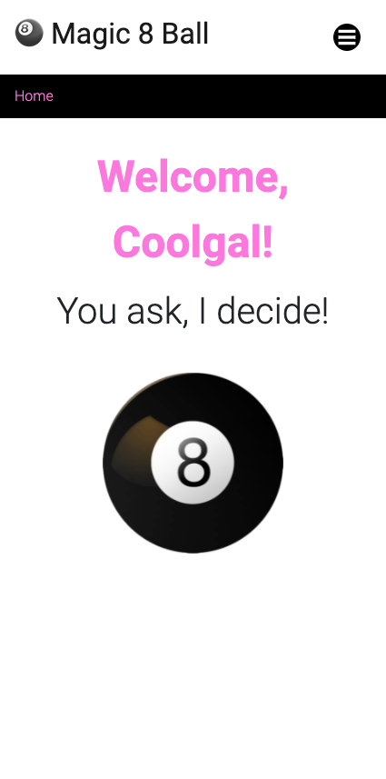
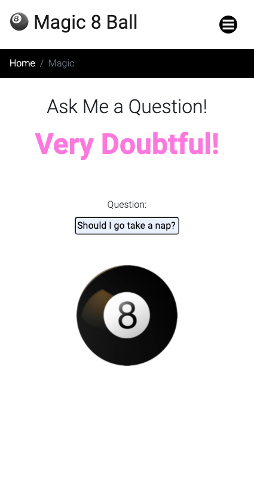
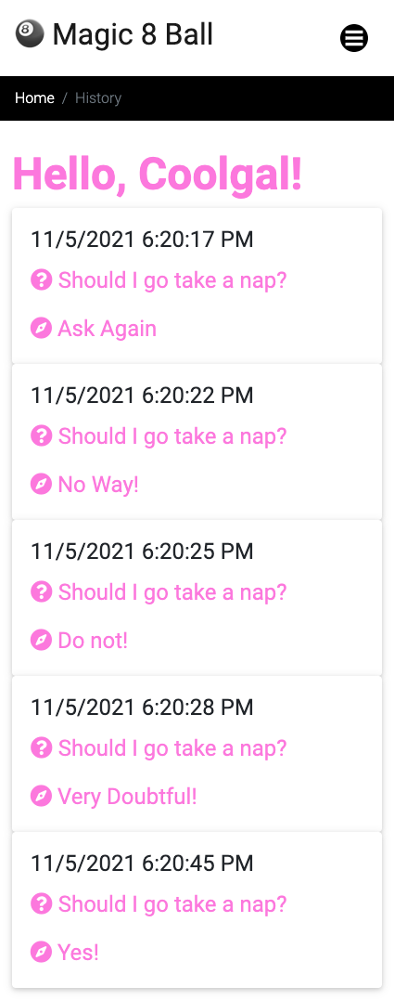

# Magic 8 Ball 🎱

## Table of Contents

- [Description](#description)
- [Link to App](#link-to-app)
- [Usage](#usage)
- [Screenshots](#screenshots)
- [Credits](#credits)
- [License](#license)

## Description

- We couldn't decide what app to build, so we built an app to make the decision for us.

- What to do? - Modern life is uncertain but pressures us into stressful decisions. Let us take the responsibility off your shoulders!

- The user asks a question and the app generates a random answer to help them come to a decision, while also finding something else to blame.

## Link to App

Please go to [Heroku Deployment Page](https://magic8-ezi.herokuapp.com/).

## Usage

1. Click Sign Up.
2. Click the Magic 8 Ball.
3. Submit a Question.
4. Get an Answer.
5. Click History to view your question and answer history.
6. Log Out or Log In.

## Screenshots

The following images demonstrate the functionality of the app:

### Home Page:

 

### Magic Page:

 

### History Page:

## Credits 🏆

Thank you, Elena!
Thank you, Zack!
Thank you, Ivo!
Thank you, Wells!
Thank you, John!

## License

None.

